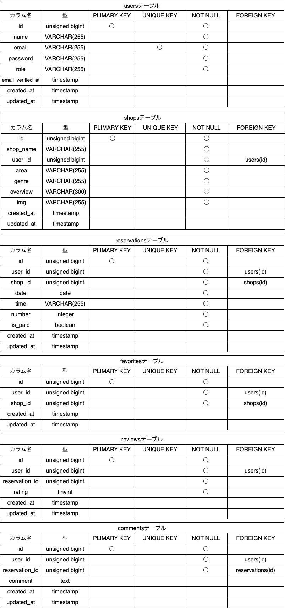
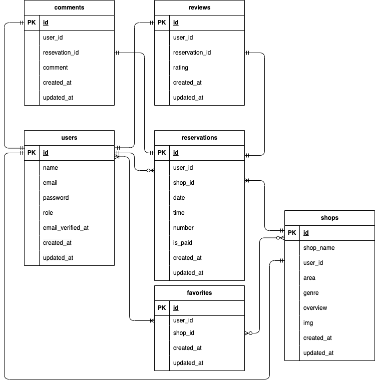

# Rese

ある企業のグループ会社の飲食店予約サービス

## 作成した目的

外部の飲食店予約サービスは手数料を取られるので自社で予約サービスを持ちたい。

## 機能一覧

- 会員登録
- ログイン(メール認証)
- ログアウト
- ユーザー情報取得
- ユーザー飲食店お気に入り一覧取得
- 飲食店一覧取得
- 飲食店お気に入り(いいね)追加、削除
- 飲食店予約情報追加、削除
- 検索（エリア、ジャンル、店名）
- 飲食店予約情報変更
- 評価機能、コメント
- 管理者ページ（店舗代表者の作成）
- 店舗代表者ページ（予約確認、店舗情報の作成と更新）
- QR コード（マイページから）
- 事前決済(マイページから可能)

## 使用技術(実行環境)

- PHP7.4.9
- Laravel8.83.29
- MySQL8.0.26
- MailHog
- Stripe
- AWS(EC2,S3,RDS,IAM,SES)

## テーブル設計



## ER 図



## 環境構築

**Docker ビルド**

1. https://github.com/youhonami/Rese.git
2. DockerDesktop アプリを立ち上げる
3. `docker-compose up -d --build`

> _Mac の M1・M2 チップの PC の場合、`no matching manifest for linux/arm64/v8 in the manifest list entries`のメッセージが表示されビルドができないことがあります。
> エラーが発生する場合は、docker-compose.yml ファイルの「mysql」内に「platform」の項目を追加で記載してください_

```bash
mysql:
    platform: linux/x86_64(この文追加)
    image: mysql:8.0.26
    environment:
```

**Laravel 環境構築**

1. `docker-compose exec php bash`
2. `composer install`
   > \_composer install に失敗する場合は、laravel/sail を個別にインストールしてみてください。`composer require laravel/sail --dev`その後`composer install`
3. 「.env.example」ファイルを 「.env」ファイルに命名を変更。または、新しく.env ファイルを作成
4. .env に以下の環境変数を追加

```
DB_CONNECTION=mysql
DB_HOST=mysql
DB_PORT=3306
DB_DATABASE=laravel_db
DB_USERNAME=laravel_user
DB_PASSWORD=laravel_pass

MAIL_FROM_ADDRESS=認証メールの送信元となるメールアドレスを入力してください
```

5. アプリケーションキーの作成

```bash
php artisan key:generate
```

6. マイグレーションの実行

```bash
php artisan migrate
```

7. シーディングの実行

```bash
php artisan db:seed
```

8. ストレージのシンボリックリンクを作成

```bash
php artisan storage:link
```

9. Stripe API 設定
   **Stripe の管理画面** から API キーを取得してください。
   `.env` ファイルを開き、以下のように設定してください。

```bash
STRIPE_KEY=sk_test_あなたのAPIキー
STRIPE_SECRET=sk_test_あなたのシークレットキー
```

10. 予約リマインダー機能 設定
    予約当日の午前 10 時に、自動でリマインダーメールを送信する機能を実装しています。

- 対象: 本日予約のユーザー
- 送信時刻: 毎日 10:00（JST）
- 使用コマンド: `php artisan reservations:remind`
- 実装場所:
  - `app/Console/Commands/SendReservationReminders.php`
  - `app/Console/Kernel.php` にスケジュール定義あり

### Docker 環境でのスケジュール実行設定（Mac）

ホストマシン側で `crontab -e` に以下を追記してください：

```crontab
SHELL=/bin/bash
TZ=Asia/Tokyo

* * * * * /usr/local/bin/docker exec rese-php-1 php /var/www/artisan schedule:run >> /tmp/schedule.log 2>&1
```

## URL

- 開発環境:http://localhost
- phpMyAdmin:http://localhost:8080/
- MailHog:http://localhost:8025/
- AWS 環境:http://18.176.61.9/

##備考

- 管理者のログイン ID とパスワード

```
aaa@aaa.co.jp
aaaaaaaaaa
```

- 店舗代表者のログイン ID とパスワード

```
店舗名@rese.jp (例：sennin@rese.jp)
ssssssssss(シーディング対象の店舗は共通)
```
